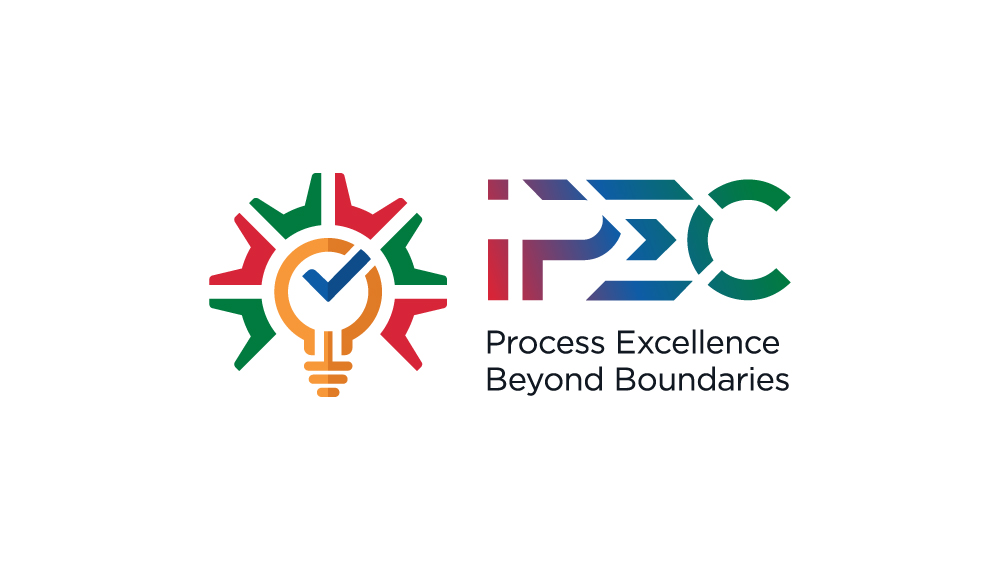

<p align="center">
  
</p>

<h1 align="center">IPEC Expense Manager</h1>

<p align="center">
  <strong>The Official Expense Tracking & Reimbursement Portal for IPEC Consulting</strong>
</p>

<p align="center">
  <a href="https://i.fouralpha.org/"></a>
  
  
</p>

---

## 📌 Overview

**IPEC Expense Manager** is a comprehensive, progressive web application (PWA) designed to streamline financial operations for the International Process Excellence Council. It facilitates seamless expense submission for employees and provides robust approval workflows for administrators — all with offline capability and real-time sync.

---

## ✨ Features

### 👤 Employee Portal (`emp.html`)
- **Dashboard** — View total paid/pending claims at a glance
- **Create Claim** — Modal form with receipt upload (ImageKit/Firebase), multi-currency support, and expense categorization
- **Claim History** — Searchable list of all submitted claims with status badges
- **Profile Management** — Edit personal details and download personal data (GDPR-ready)

### 🛡️ Admin Command Center (`admin.html`)
- **Approval Workflow** — Review pending claims, view receipts, and Approve/Reject with comments
- **Analytics** — Visual charts (Chart.js) for spending by category/month
- **User Management** — Add/Edit/Remove system users and assign roles
- **Project Management** — Create and manage billing codes/projects
- **Audit Logs** — Detailed timeline of all system actions for compliance

### 🌐 Platform
- **PWA** — Installable on Android, iOS, Windows, and macOS with full offline support
- **Role-Based Access Control** — Separate, secure portals for Employees and Administrators
- **Real-Time Sync** — Instant updates via Firebase Firestore
- **AI Assistant** — Built-in AI chatbot for policy queries and support
- **Direct Chat** — Integrated messaging system for internal communication
- **PDF Reports** — Generate and download expense reports as PDF

---

## 🛠️ Tech Stack

| Layer            | Technology                                   |
|------------------|----------------------------------------------|
| **Frontend**     | HTML5, Vanilla JavaScript (ES6+), Tailwind CSS |
| **Backend**      | Firebase (Firestore, Auth, Storage, Cloud Functions) |
| **Media Storage**| ImageKit.io                                  |
| **Charts**       | Chart.js                                     |
| **PDF Export**   | html2pdf.js                                  |
| **Hosting**      | Netlify                                      |
| **PWA**          | Service Worker (Network-first + Cache-first strategies) |

---

## 🚀 Getting Started

### Prerequisites
- A modern browser (Chrome, Edge, Firefox, or Safari)
- A Firebase project with Firestore, Auth, and Storage enabled
- Node.js (only required for Cloud Functions in `/functions`)

### Installation

1. **Clone the repository**
   ```bash
   git clone https://github.com/your-username/expense-tracker.git
   cd expense-tracker
   ```

2. **Deploy Cloud Functions** *(optional)*
   ```bash
   cd functions
   npm install
   firebase deploy --only functions
   ```

4. **Run locally**

   Serve the project using any static file server:
   ```bash
   npx serve .
   ```
   Then open `http://localhost:3000` in your browser.

5. **Deploy to Netlify**

   Push to your connected GitHub repo — Netlify will auto-deploy. The `_redirects` file handles SPA routing automatically.

---

## 📂 Project Structure

```
├── assets/
│   └── images/              # All image assets
│       ├── ipec.jpg         # Brand logo (PWA icon, apple-touch-icon)
│       ├── cropped-ipec-logo-32x32.png  # Favicon
│       └── s1.png, s2.png, s3.png       # PWA screenshots
│
├── css/
│   └── common.css           # Shared styles
│
├── js/
│   ├── theme.js             # Dark/Light mode toggle
│   ├── utils.js             # Shared utility functions
│   ├── admin-helper.js      # Admin-specific calculations
│   ├── ai-support.js        # AI chatbot widget logic
│   ├── firebase-config.js   # Firebase initialization
│   ├── spam-filter.js       # Spam detection for messaging
│
├── scripts/                 # Build & maintenance scripts (Python)
│   ├── make_common_css.py
│   ├── update_admin_emp.py
│   └── update_index.py
│
├── functions/               # Firebase Cloud Functions
│   ├── index.js
│   └── package.json
│
├── index.html               # Landing page (public entry point)
├── emp.html                 # Employee portal
├── admin.html               # Admin command center
├── 404.html                 # Custom "Page Not Found"
├── offline.html             # Offline fallback page
│
├── sw.js                    # Service worker (PWA)
├── firebase-messaging-sw.js # FCM worker
├── manifest.json            # Web App Manifest
├── firestore.rules          # Firestore security rules
│
├── .well-known/             # security.txt
├── robots.txt, sitemap.xml  # SEO
├── _redirects               # Netlify routing
├── feed.xml, opensearch.xml # RSS & search
├── browserconfig.xml        # Windows tile config
├── humans.txt               # Team credits
└── LICENSE                  # MIT License
```

---

## 🔒 Security

- **Firebase Rules** — Firestore rules (`firestore.rules`) ensure authenticated access only
- **Security Policy** — Standardized `security.txt` in `.well-known/`
- **Input Validation** — Spam filtering on messaging features

---

## 🤝 Contributing

Contributions are welcome! To get started:

1. Fork this repository
2. Create a feature branch (`git checkout -b feature/amazing-feature`)
3. Commit your changes (`git commit -m 'Add amazing feature'`)
4. Push to the branch (`git push origin feature/amazing-feature`)
5. Open a Pull Request

Please ensure your code follows the existing style and conventions.

---

## 📄 License

This project is licensed under the **MIT License** — see the [LICENSE](LICENSE) file for details.

---

<p align="center">
  Made with ❤️ by <a href="https://mitanshubhasin.netlify.app">Mitanshu Bhasin</a> for <strong>IPEC Consulting</strong>
  <br />
  &copy; 2026 International Process Excellence Council. All Rights Reserved.
</p>
